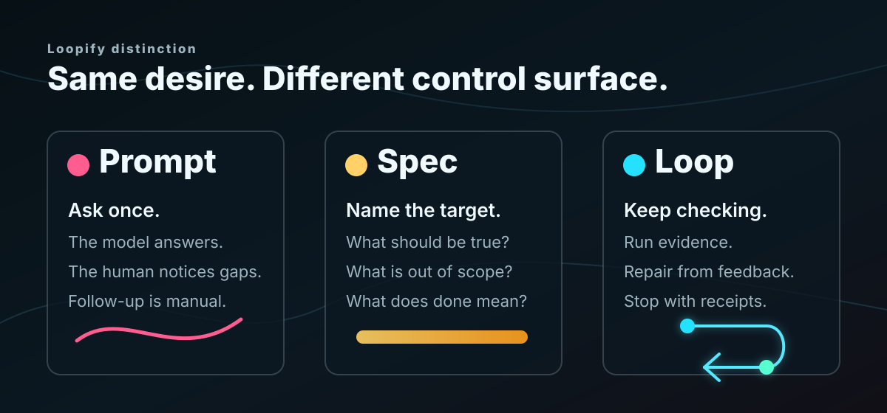
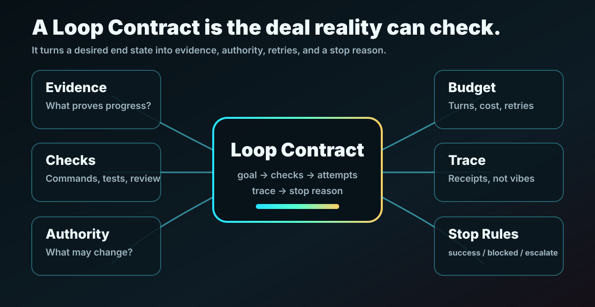

<p align="center">
  
</p>

<p align="center">
  <a href="https://github.com/AndreRatzenberger/loopify"></a>
  <a href="https://github.com/AndreRatzenberger/loopify"></a>
  <a href="https://github.com/AndreRatzenberger/loopify"></a>
  <a href="https://opensource.org/licenses/MIT"></a>
</p>

<p align="center">
  <em>"Loop yes. Prompt no" - Caveman Codex 06/2026</em>
</p>


Stop writing heroic prompts. Start writing contracts reality can check.

**Loopify** is a Claude plugin-format skill bundle for turning specs into
executable feedback loops. A prompt asks for an answer. A loop gives the agent
a workbench: check reality, patch the thing, write down what happened, stop for
a reason.

Think of it as **promptcraft with receipts**. Tiny bureaucracy for ambitious
agents. The kind where "done" has to show its work.

Or as Caveman Codex would say:

> Spec alone: "Want fire."
>
> Prompt alone: "Please make fire."
>
> Loop: "Try make fire. Check smoke. If hand burns, stop. Write what happened."

---

## ⚡ Quick Loop

**1. Install the loop machine**

Codex CLI:

```bash
codex plugin marketplace add AndreRatzenberger/loopify
codex plugin add loopify-agent-skills@loopify
```

Or browse it interactively:

```text
codex
/plugins
```

In the Codex app or desktop surface, open **Plugins**, search for Loopify, then
choose **Add to Codex** / **Install plugin**. If Loopify is not visible yet, add
the marketplace from the CLI command above, restart or refresh Codex, and check
the marketplace list again. Shared workspace installs can also appear under
**Shared with you**.

Claude Code/Github Copilot:

```text
/plugin marketplace add AndreRatzenberger/loopify
/plugin install loopify-agent-skills@loopify
```

Other agent harnesses: Ask your bot.

Give it https://github.com/AndreRatzenberger/loopify and ask it to install or
load the `loopify-agent-skills` bundle.

**2. Turn a spec into a loop folder**

```text
Use loopify-spec on docs/goals/goal.md and bootstrap it into .loopify/loops/001-first-loop/.
```

For a read-only compile, omit `and bootstrap it`; `loopify-spec` will only
write the contract. Add the bootstrap phrase when you want repo files.

**3. Run until the loop earns a stop reason**

```text
Use loopify-run on .loopify/loops/001-first-loop/. Stop only with success, blocked, escalated, or budget-exhausted.
```

**What just happened?**

- **The spec** said what should become true.
- **The Loop Contract** named evidence, checks, authority, retries, and stop
  rules.
- **The run** checked reality, patched from feedback, wrote a trace, and stopped
  with receipts.

You got a paper trail instead of a victory monologue. 🧾

---

## 🗂️ Loop Folders: One Feature, One Folder

Loopify saves runnable work as numbered folders:

```text
.loopify/
  index.md
  loops/
    001-first-loop/
      source.md
      loop-contract.md
      quality-gate.sh
      acceptance-checklist.md
      trace.md
      final-report.md
      retro.md
      artifacts/
    002-next-feature/
      ...
```

Why folders? Because repos collect quests. First feature, weird bug, polish
pass, release pass. One global contract turns into a junk drawer. Numbered loop
folders keep each little adventure inspectable.

`loopify-spec` can hand off to `loopify-bootstrap` when the user explicitly
asks for it: "spec and bootstrap it", "make this runnable", or "create the loop
folder." Without that phrase, it stays pure and writes only the Loop Contract.

---

## 🔁 Prompt vs Spec vs Loop

<p align="center">
  
</p>

- **Prompt**: ask once and hope.
- **Spec**: describe the desired end state.
- **Loop**: check reality against the contract until the work earns a stop
  reason.

Prompts still matter. They are no longer the unit of done.

Tiny Twitter bite: when someone says "LLMs are not intelligent enough for
loops," ask which loop they mean.

The scary loop is unbounded: the model invents goals, judges itself, mutates
its own harness, and ships when it feels done. Loopify is the boring loop: a
contract, allowed actions, checks, budgets, trace, and stop reasons. It does
not ask the model to become wise. It makes the model bump into reality more
often.

If a dunk treats those as the same thing, it is not arguing with Loopify. It is
arguing with a monster made out of the word "loop." Define the harness, then
tweet.

---

## 📜 Loop Contract: The Deal Reality Can Check

<p align="center">
  
</p>

A Loop Contract answers the questions a one-shot prompt usually hand-waves:

- **Goal**: what output or state counts?
- **Evidence**: what proves progress?
- **Authority**: what may the loop read, write, call, spend, or publish?
- **Checks**: which commands, tests, screenshots, or reviews count?
- **Budget**: how many turns, retries, minutes, or dollars are allowed?
- **Stop**: what ends in success, blocked, escalated, or budget-exhausted?
- **Trace**: what receipt does the loop leave behind?

Without those, "looping" burns tokens while the model chases its own
reflection. Cyberpunk, sure. Useful, no.

The contract is boring on purpose. Boring is how the agent remembers where the
sharp objects are.

---

## 🧰 The Skill Chest

Loopify ships 11 skills. The spine is small:

```text
loopify-spec -> loopify-bootstrap -> loopify-run -> loopify-trace
```

The `loopify-spec -> loopify-bootstrap` edge is explicit. Say "bootstrap it" or
"create the loop folder" when you want that mutation.

| Skill | What it does |
| --- | --- |
| `loopify-spec` | Converts prose specs into Loop Contracts, optionally handing off to bootstrap when asked. |
| `loopify-bootstrap` | Seeds `.loopify/loops/NNN-slug/` with source, contract, quality gate, trace, checklist, and index entry. |
| `loopify-run` | Executes a loop folder by checking, patching, rerunning, and tracing. |
| `loopify-checks` | Turns vague requirements into honest evidence. |
| `loopify-trace` | Keeps receipts across attempts. |
| `loopify-review` | Audits contracts, traces, done claims, and residual risk. |
| `loopify-debug` | Rescues stuck loops before they become doom spirals. |
| `loopify-demo` | Builds public-safe demo material packs. |
| `loopify-codex-sdk` | Treats Codex SDK calls as actuators inside a larger loop. |
| `loopify-retro` | Turns one loop's failures into better future loops. |
| `loopify-governance` | Adds budgets, approvals, rollback, and authority boundaries. |

Each skill keeps its `SKILL.md` lean. Deeper guidance lives in `references/`;
copyable output shapes live in `templates/`; deterministic helpers live in
`scripts/`. The agent sees the short path first and can reach for the heavy
tools when the loop bites back.

---

## 🧪 Try the PaperTrail Stress Fixture

The repo includes a deliberately chunky app request:

```text
docs/goals/prompt.md
```

It asks for a research-paper catalog with arXiv ingestion, GraphRAG, fallbacks,
logging, four views, and mandatory Playwright testing. It is lumpy in all the
right ways. A one-shot prompt would smile, nod, and quietly lose half the
requirements.

Try:

```text
Use loopify-spec on docs/goals/prompt.md and bootstrap it into .loopify/loops/001-papertrail/.
```

Then inspect:

```text
.loopify/loops/001-papertrail/loop-contract.md
```

If the contract maps requirements to evidence, names manual review, and refuses
to pretend taste is a unit test, the loop is doing its job.

---

## 🛡️ Stop Rules: Loopify Isn't That Reckless

Every loop stops with one of four reasons:

- `success`: the checks pass and manual/visual gates are satisfied or queued.
- `blocked`: the same blocker repeats or a required dependency is unavailable.
- `escalated`: a human decision is required.
- `budget-exhausted`: the contract's turn, time, retry, or cost budget is done.

A loop without stop rules is not autonomy. It is an expensive `while true`
wearing a cape.

---

## 🧬 Codex SDK: The Actuator, Not the Whole Creature

`loopify-codex-sdk` can help scaffold repair, review, evaluator, context-builder,
or trace-summarizer actuators.

But the SDK call is not the loop. The loop still owns:

- state
- checks
- authority
- budgets
- stop rules
- trace
- review

Concrete SDK calls are intentionally template-based until current official SDK
docs are checked in the consuming project. No fake APIs. No confidence cosplay.

---

## 💻 Development: Working With This Repo

Run the quality gate:

```bash
npm run quality
git diff --check
```

What it checks:

- marketplace and plugin manifests parse
- all 11 skills exist
- every skill has the required sections
- required references/templates/scripts are present
- example Loop Contracts contain the required headings
- the stuck-loop debug fixture has enough trace data to diagnose

Project shape:

```text
loopify/
├── .claude-plugin/marketplace.json
├── docs/
│   ├── assets/
│   ├── concepts/
│   ├── examples/
│   └── goals/
├── plugins/
│   └── loopify-agent-skills/
│       ├── .claude-plugin/plugin.json
│       ├── README.md
│       └── skills/
└── scripts/
```

---

## 🤔 FAQ

**Q: Is Loopify anti-prompt?**
A: Nope. Prompts are ingredients. Loops are the recipe notes, oven timer, smoke
alarm, taste test, and cleanup checklist.

**Q: Is a Loop Contract just a spec?**
A: No. A spec says what should be true. A Loop Contract says how reality is
allowed to prove it became true.

**Q: Can this run unattended?**
A: Sometimes. The safer answer is: it can run until its authority, budget, or
stop rules say otherwise.

**Q: Why all the trace fuss?**
A: Because "the model said it is done" is not evidence. A trace lets a human see
what happened, what failed, what changed, and what remains unproven.

**Q: Is this production-ready?**
A: It's a first release of a skill bundle, not a compliance vending machine.
Use `loopify-governance` when loops touch production, money, data,
dependencies, or public content.

---

## 📜 License

MIT.

**Go forth and stop for boring, well-documented reasons.** 🔁

Your prompts will never be the same.
